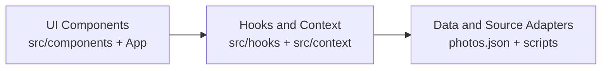
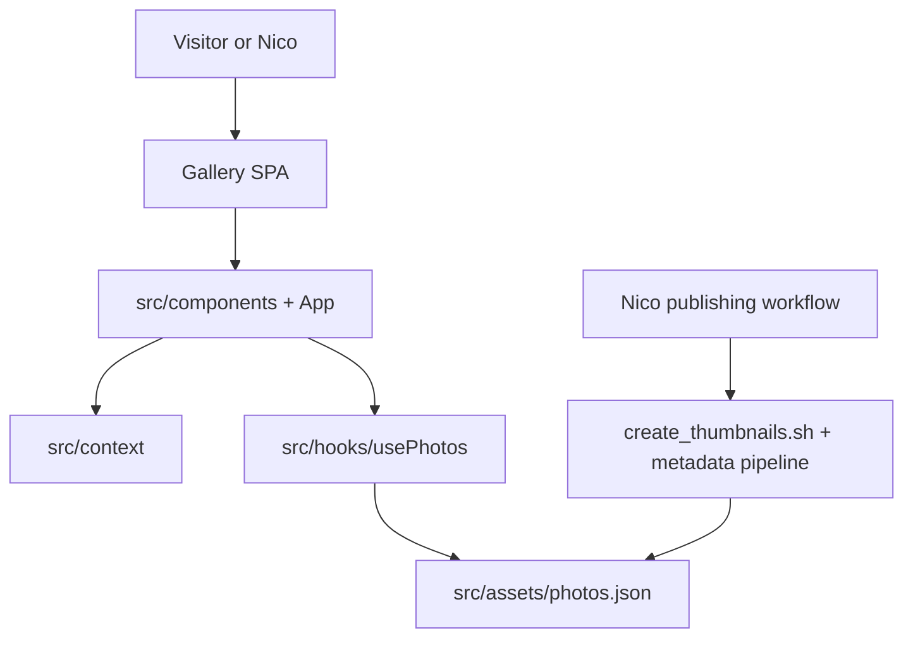

# Architecture Spine - Gallery

## Design Paradigm

Layered React app.

- UI layer: `src/components` and `src/App.tsx` compose user interactions and rendering.
- Domain/UI-state layer: `src/hooks` and `src/context` hold derivation and interaction state rules.
- Data/source adapter layer: `src/assets/photos.json` consumption plus script-driven preprocessing inputs.

## Invariants & Rules

### AD-1 - Layered dependency direction [ADOPTED]

- **Binds:** all
- **Prevents:** ad-hoc cross-layer coupling where components perform data-source logic directly, or adapters mutate UI state directly.
- **Rule:** Dependencies are one-way: UI -> hooks/context -> data/source adapters. Lower layers never import from higher layers.



### AD-2 - State ownership and mutation boundary [ADOPTED]

- **Binds:** FR-2, FR-5, FR-6, FR-10
- **Prevents:** multiple write paths for UI state, accidental shared-data mutation, and inconsistent filter/lightbox behavior.
- **Rule:** `FilterContext` and `LightboxContext` are the only cross-component UI state owners. `usePhotos` performs read-only derivation from `Photo Record` data and selected year. Components mutate cross-component state only through explicit context setters/actions. The clear-year sentinel is `null` only (no `undefined` or string sentinels).

### AD-3 - Verification gate contract [ADOPTED]

- **Binds:** FR-1, FR-4, FR-7, FR-8, FR-10
- **Prevents:** inconsistent quality checks across change batches, upgrade merges with hidden regressions, and unverified behavior changes in critical interaction flows.
- **Rule:** Every change batch follows `lint -> build -> unit -> e2e` in that order. Upgrade batches merge only when all four gates pass. Any change touching lightbox/filter reliability paths must add or update at least one automated assertion in unit or e2e tests. Any change touching context contracts, `usePhotos` output shape, or adapter schema must include contract tests covering provider-consumer compatibility.

### AD-4 - Photo Record schema tolerance boundary [ADOPTED]

- **Binds:** FR-2, FR-5, FR-11
- **Prevents:** runtime crashes from missing metadata, duplicated fallback logic across components, and mixing normalization responsibilities into rendering logic.
- **Rule:** `Photo Record` metadata is treated as optional at UI and hook boundaries, with safe rendering fallbacks for missing values. Field normalization and cleanup are owned by the data/script adapter layer, not by presentation components. Adapter output must conform to a single normalized schema used by hooks/components (including numeric year semantics and nullability expectations).

### AD-5 - Upgrade Batch ownership and rollback contract [ADOPTED]

- **Binds:** FR-7, FR-8, FR-9, FR-10
- **Prevents:** parallel dependency upgrade streams that hide causality, partial-failure merges, and unclear accountability for batch verification outcomes.
- **Rule:** Each `Upgrade Batch` has one owner and one verification artifact recording changed packages and gate outcomes. If any gate fails, revert the entire batch before starting the next. Only one Upgrade Batch may be in flight at a time.

### AD-6 - Filter and lightbox synchronization invariant

- **Binds:** FR-2, FR-6, FR-10
- **Prevents:** stale lightbox selection after filter or data changes, index-out-of-range navigation, and mismatched selected photo state.
- **Rule:** When filtered photo sets change, lightbox selection is revalidated atomically against the new set. Selection must reference a valid current photo or close the lightbox; index-based navigation must never operate on stale arrays.

## Consistency Conventions

| Concern | Convention |
| --- | --- |
| Naming (entities, files, interfaces, events) | React components and context modules use PascalCase files; hooks use `useX` naming; keep existing glossary terms (`Photo Record`, `Lightbox`, `Upgrade Batch`) unchanged across docs and code comments. |
| Data and formats (ids, dates, error shapes, envelopes) | Treat `Photo Record` metadata fields as nullable/optional at render boundaries; keep year filtering typed as `number | null`; preserve existing photo ordering contract (descending by file key) unless changed with tests. |
| State and cross-cutting (mutation, errors, logging, config, auth) | Cross-component state writes only through context setters; hooks stay side-effect-light; runtime guards return safe fallback UI for missing metadata; avoid persistent debug logging in committed code. |

## Stack

| Name | Version |
| --- | --- |
| TypeScript | `~5.9.3` |
| React | `^19.2.0` |
| React DOM | `^19.2.0` |
| Vite | `^7.2.4` |
| `@vitejs/plugin-react` | `^5.1.1` |
| ESLint | `^9.39.1` |
| `typescript-eslint` | `^8.46.4` |
| Playwright | `^1.57.0` |
| Bootstrap | `^5.3.8` |
| React-Bootstrap | `^2.10.10` |

## Structural Seed



```text
src/
  components/   # gallery, navigation, lightbox, footer rendering
  context/      # cross-component UI state ownership
  hooks/        # derived-photo logic and reusable interaction rules
  assets/       # photo data source consumed by app
tests/
  *.spec.ts     # browser-level behavior coverage
  helpers.ts    # page object for stable selectors/actions
```

## Capability -> Architecture Map

| Capability / Area | Lives in | Governed by |
| --- | --- | --- |
| FR-1 Baseline verification snapshot | npm scripts, CI workflow, Playwright config | AD-3 |
| FR-2 Lightbox failsafe with incomplete Photo Record data | `src/components/Lightbox.tsx`, `src/hooks/usePhotos.tsx` | AD-2, AD-4 |
| FR-3 Remove unused runtime dependencies | `package.json`, import graph checks | AD-1, AD-3 |
| FR-4 Unit testing toolchain integration | test config/scripts, `tests/`, new unit test directory | AD-3 |
| FR-5 Filtering and sorting tests | `src/hooks/usePhotos.tsx`, unit tests | AD-2, AD-4 |
| FR-6 Lightbox boundary interaction tests | `src/components/Lightbox.tsx`, unit/e2e tests | AD-2, AD-3, AD-6 |
| FR-7 Upgrade batches with gates | dependency update workflow and verification artifacts | AD-3, AD-5 |
| FR-8 Compatibility remediation | TypeScript/Vite/ESLint/test configs and source updates | AD-1, AD-3, AD-5 |
| FR-9 Deferred-major rationale capture | upgrade tracking docs/artifacts | AD-5 |
| FR-10 Regression resolution pass | issue list + full verification run | AD-2, AD-3, AD-5, AD-6 |
| FR-11 Script/data resilience improvements | image/metadata scripts and adapter boundary | AD-1, AD-4 |
| FR-12 Maintenance workflow documentation | README/docs maintenance checklist | AD-3, AD-5 |

## Deferred

- Choosing the exact unit-test folder layout and helper abstractions (decidable during FR-4 implementation as long as AD-3 gate contract is preserved).
- ~~Choosing long-term home for maintenance checklist (`README` vs dedicated docs page) pending owner preference.~~ **Resolved during Story 4.3** — `MAINTENANCE.md` at project root is the canonical location.
- Deciding whether to introduce automated dependency bot tooling (Dependabot/Renovate) after this cycle; current spine governs manual Upgrade Batch flow only.
